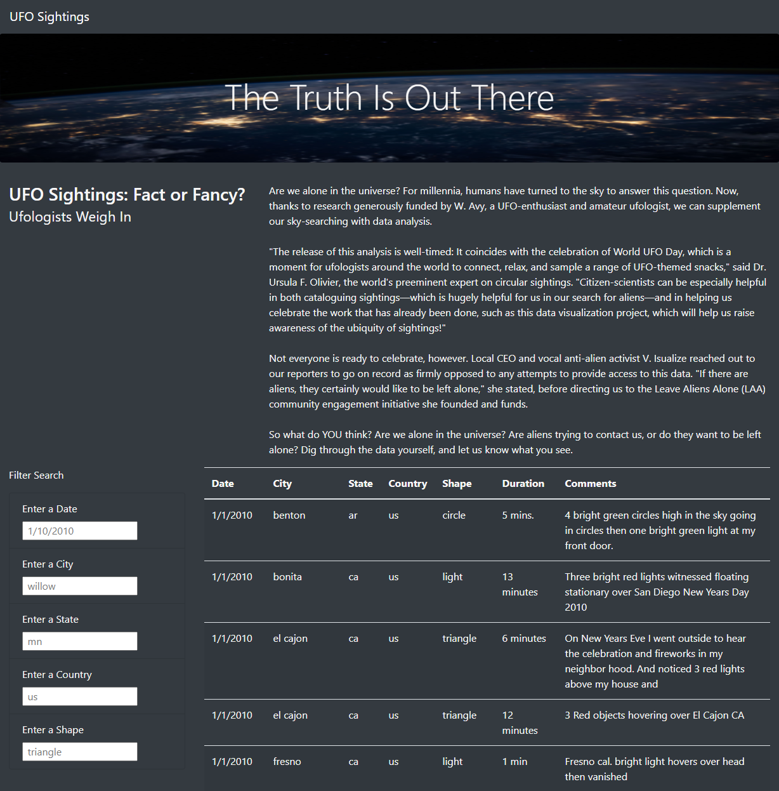
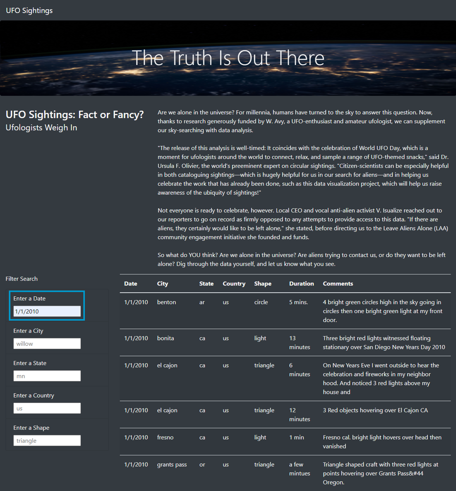

# UFOs

## Overview
Dana, a seasoned data journalist wants to create a webpage that includes a dynamic table that can be filtered by date. The purpose of this analysis is to provide a more in-depth analysis of UFO Sightings by allowing users to filter for multiple criteria at the same time. Code was refactored to add table filters for the city, state, country, and shape in addtion to the date. The results, drawbacks, and recommendations for further development are discussed below.

## Results
Here are some instructions on how to use the webpage's search criteria:

- The UFO Sightings webpage includes a searchable table for UFO events. You can filter the table by Date, City, State, Country, and/or Shape in the "Filter Search" container.

 

- To filter by Date, enter a date following the format shown in the placeholder text and press Enter or Tab. The search will return results for the date specified.

 

- To filter by City, enter the city name and press Enter or Tab. You may enter the State as well to further refine your search to exclude cities with the same name from a different state.

 

- To only filter by State, clear out the other filter fields and only enter the two-letter state abbreviation, then press Enter or Tab.

 

- To filter by Country, enter the two-letter country abbreviation code and press Enter or Tab.

 

- To filter by Shape, enter the shape and press Enter or Tab.

 

- The more filters you enter, the more refined your search results will be.

 

- To clear all filters, click on the "UFO Sightings" link located at the top left of the page.

### Tips while filtering
If you are trying to search for a specific UFO event and there are no returns, try loosening your search criteria. You will receive more search results with less filters applied.

## Summary

### Drawbacks
Below are some of the drawbacks of this webpage:
1. This webpage will only filter entries according to exact matches in lowercase. It will not register partial matches or text in mixed- or uppercase. The spaces in the text will also need to be exact for the filters to function properly.
2. It is not very straightforward to know how to clear the filters. To clear the filters, the "UFO Sightings" link at the top left of the page needs to be clicked.

### Recommendations for further development
1. Modify the code to accept text in any case. We can achieve this by using code `string.toLowerCase()` or `string.toUpperCase` to temporarily convert the text input to either fully lowercase or uppercase so that the matching can be done. 
2. Modify the code to accept partial text matches. This can be achieved by using the includes method `.includes()` or the indexOf method `.indexOf()`.
3. Create a "clear filters" button within the filter search container so it is easily identified. 
